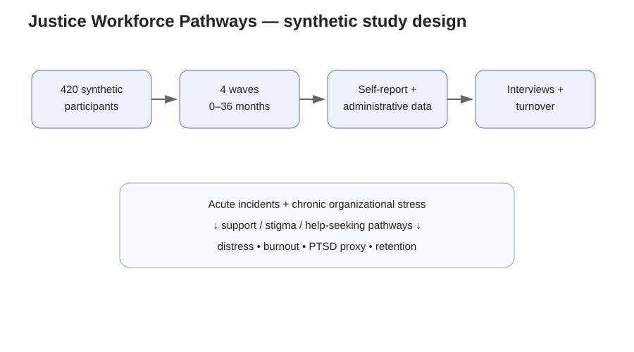
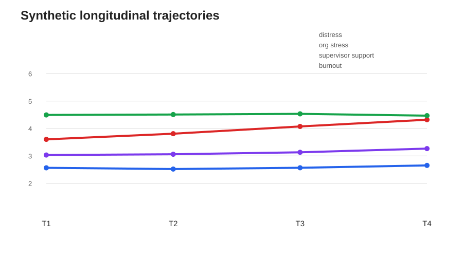
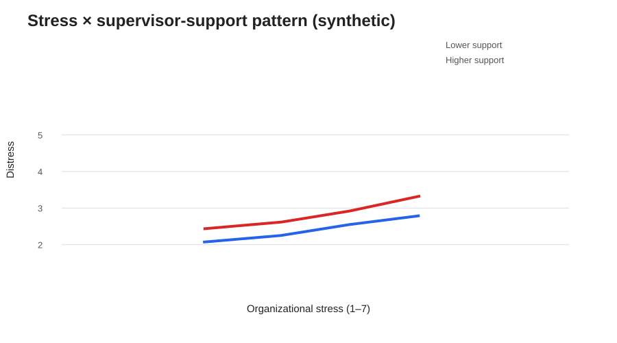
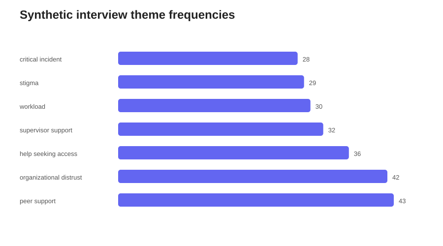
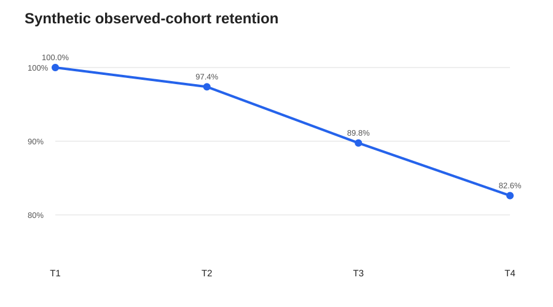

# Justice Workforce Pathways

A reproducible **synthetic longitudinal mixed-methods research prototype** for studying how acute critical-incident exposure and chronic organizational stress jointly shape mental health, help-seeking, and retention in justice-system personnel.

> **Synthetic-data notice:** Every participant, facility, interview excerpt, event, and result in this repository is simulated. Nothing here is a real officer record or empirical finding.



## Research questions

1. Do chronic organizational stressors predict distress beyond acute critical-incident exposure?
2. Does supervisor/peer support buffer the association between organizational stress and distress?
3. Do help-seeking stigma and support help explain later well-being?
4. Can administrative indicators (overtime, sick leave, critical incidents) add information beyond self-report?
5. Which qualitative themes co-occur with higher distress and lower help-seeking?
6. Which factors predict workforce turnover over follow-up?

## Design

- **N = 420** synthetic justice-system personnel across **28 facilities/units**.
- **Four waves**: entry/baseline, 12, 24, and 36 months.
- Repeated self-report measures plus linked synthetic administrative/personnel indicators.
- Synthetic semi-structured interview excerpts at waves 2 and 4.
- Planned attrition and turnover are modeled explicitly rather than deleted silently.

## Analysis stack

The project deliberately uses methods suited to clustered longitudinal workforce data:

- descriptive trajectories and facility-level variation;
- **GEE panel models** for repeated distress outcomes, including an organizational stress × supervisor-support interaction;
- organizational stress × supervisor-support moderation visualization;
- **lagged panel prediction** of later distress and help-seeking;
- **discrete-time repeated-binary turnover model** using post-baseline risk intervals and person-wave administrative data;
- structured qualitative coding and mixed-methods joint displays.

These choices reflect a research tradition that combines longitudinal interviews/surveys, organizational context, personnel/administrative information, and qualitative inquiry in correctional and justice-workforce well-being research. The repository is an independent methodological prototype, not a reproduction of any specific dataset.

## Key synthetic outputs









## Reproduce

```bash
python -m pip install -r requirements.txt
python scripts/run_all.py
pytest -q
```

`run_all.py` regenerates the cohort from a fixed seed, validates the data, runs the quantitative and qualitative analyses, writes result tables, and regenerates all five SVG figures.

## Repository structure

```text
justice-workforce-pathways/
├── scripts/
│   ├── generate_synthetic_data.py
│   ├── validate_data.py
│   ├── analyze_quantitative.py
│   ├── analyze_qualitative.py
│   ├── make_figures.py
│   └── run_all.py
├── tests/
│   └── test_pipeline.py
├── docs/
│   ├── METHODS.md
│   ├── DATA_DICTIONARY.md
│   └── INTERPRETATION.md
├── figures/
├── results/
├── .github/workflows/ci.yml
└── README.md
```

## Interpretation boundary

This repository demonstrates **research design and analytic implementation**. Synthetic coefficients must never be cited as evidence about real correctional officers, police officers, agencies, or mental-health outcomes.
