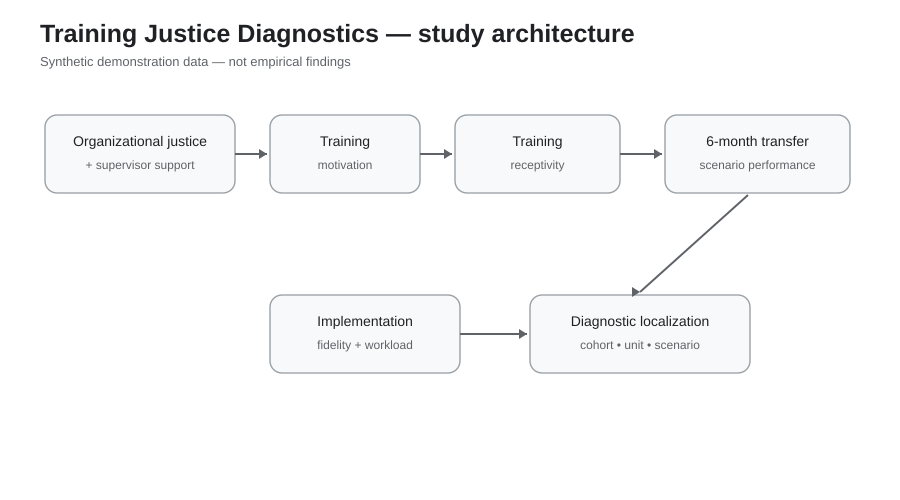
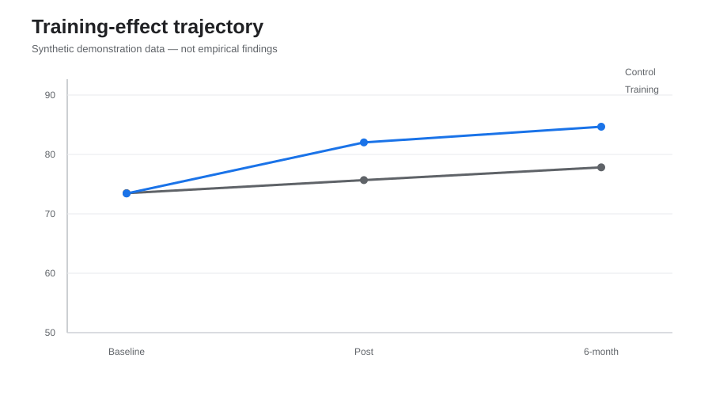
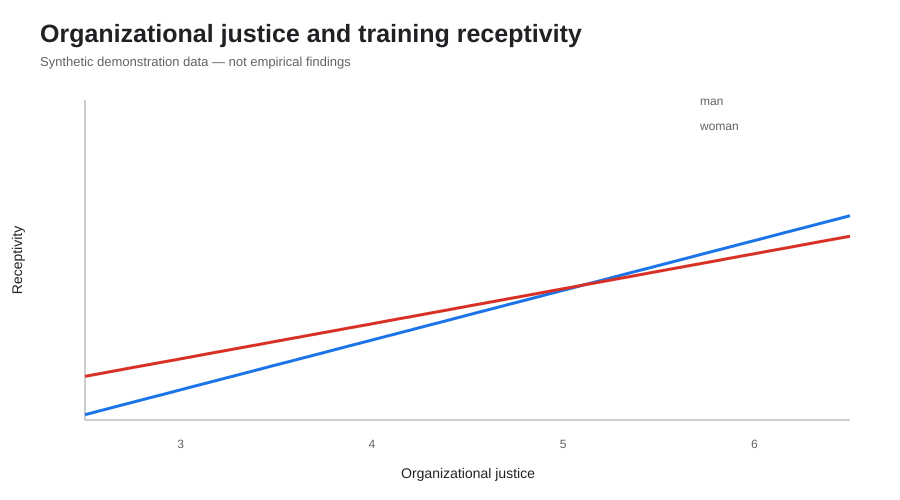
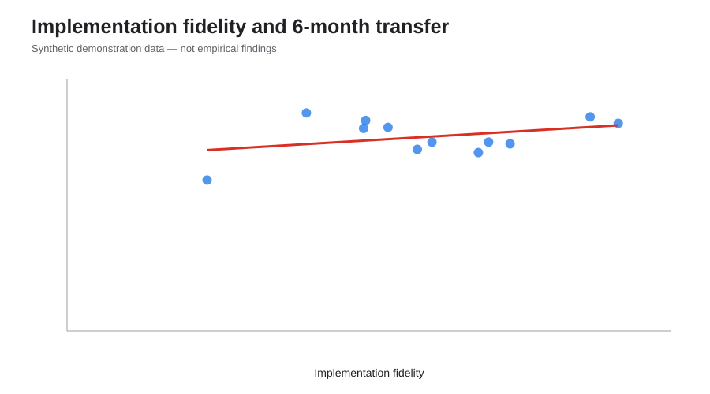
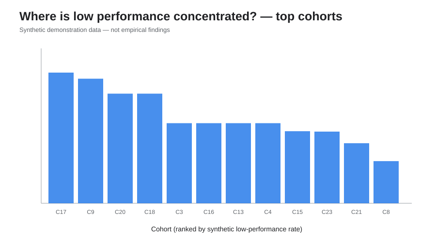
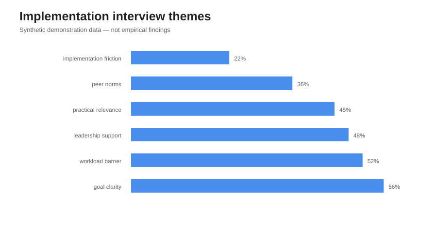
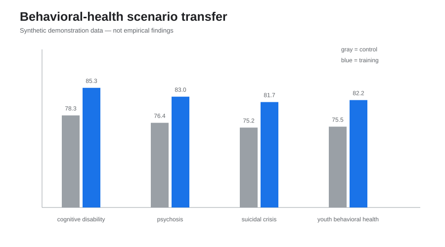
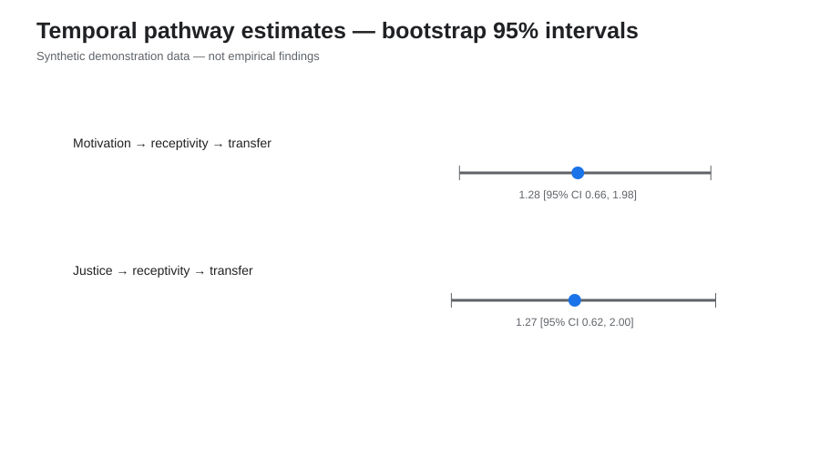

# Training Justice Diagnostics

A reproducible **synthetic longitudinal police-training evaluation prototype** connecting organizational justice, supervisor support, training motivation, training receptivity, implementation fidelity, and transfer to behavioral-health crisis scenarios.

> **Synthetic-data notice:** Every officer, cohort, interview excerpt, administrative indicator, scenario result, and coefficient in this repository is simulated. Nothing here is an empirical finding about any real police organization.



## Why this project exists
Police training research increasingly asks not only **whether training works**, but **how, why, for whom, and under what organizational conditions it works or fails**. This prototype turns that idea into a fully reproducible workflow.

It links three questions that are often analyzed separately:

1. **Fairness and readiness:** Do organizational justice, supervisor support, self-efficacy, and locus of control shape motivation to train?
2. **Receptivity and transfer:** Do motivated and receptive trainees show better later scenario performance—and does organizational context change that pathway?
3. **Diagnosis before reform:** If performance problems remain, are they agency-wide or concentrated within particular cohorts, units, or behavioral-health scenarios?

## Synthetic design
- **N = 480** synthetic officers/recruits.
- **24 training cohorts** nested in **8 units**.
- Cohort-level training vs wait-list comparison.
- **3 waves:** baseline, immediate post-training, six-month follow-up.
- Linked survey, workload/administrative, behavioral scenario, and interview streams.
- Behavioral-health scenarios include suicidal crisis, psychosis, youth crisis, and cognitive disability.

## Analysis stack
- standardized baseline balance diagnostics;
- robust OLS model of **training motivation**;
- robust OLS model of **training receptivity**, including organizational justice × gender moderation;
- longitudinal **GEE / difference-in-differences-style** training-effect model;
- temporal pathway model: motivation → receptivity → follow-up skill;
- **1,000-replicate bootstrap indirect effects** for motivation/justice → receptivity → transfer;
- repeated-scenario GEE transfer model;
- **problem-oriented concentration diagnostics** across cohorts, units, and scenario types;
- implementation-fidelity analysis;
- transparent qualitative coding and mixed-method interpretation;
- automated tests plus multi-seed simulation stress testing.

## Key synthetic outputs















## Reproduce
```bash
python -m pip install -r requirements.txt
python scripts/run_all.py
pytest -q
python scripts/stress_test.py --start 1 --count 100
```

`run_all.py` regenerates all synthetic datasets from a fixed seed, validates them, runs every quantitative and qualitative analysis, and regenerates all eight SVG figures.

## Methodological lineage
The project is an independent prototype, but its architecture is grounded in published police-research methods: longitudinal models of training motivation/receptivity/outcomes; organizational-justice theory; randomized and difference-in-differences training/intervention evaluation; mixed-method implementation analysis; and problem-oriented diagnosis of whether problems are diffuse or concentrated before reform is selected.

See [`docs/METHODS.md`](docs/METHODS.md) for the detailed methodological mapping and interpretation boundaries.

## Repository structure
```text
training-justice-diagnostics/
├── scripts/
│   ├── generate_synthetic_data.py
│   ├── validate_data.py
│   ├── analyze_quantitative.py
│   ├── analyze_qualitative.py
│   ├── make_figures.py
│   ├── run_all.py
│   └── stress_test.py
├── tests/test_pipeline.py
├── docs/
├── data/demo/
├── results/
├── figures/
└── .github/workflows/ci.yml
```

## Interpretation boundary
This repository demonstrates **research design, diagnostics, and analytic implementation**. Synthetic coefficients must never be cited as evidence about real police officers, gender groups, agencies, or training programs.
